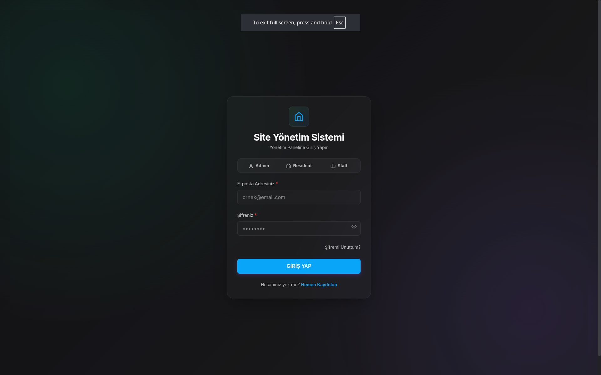
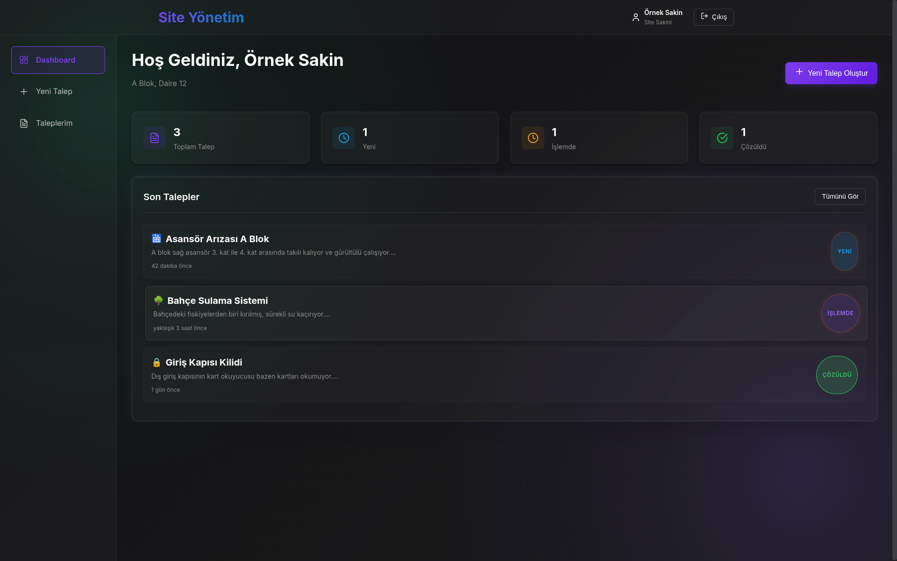
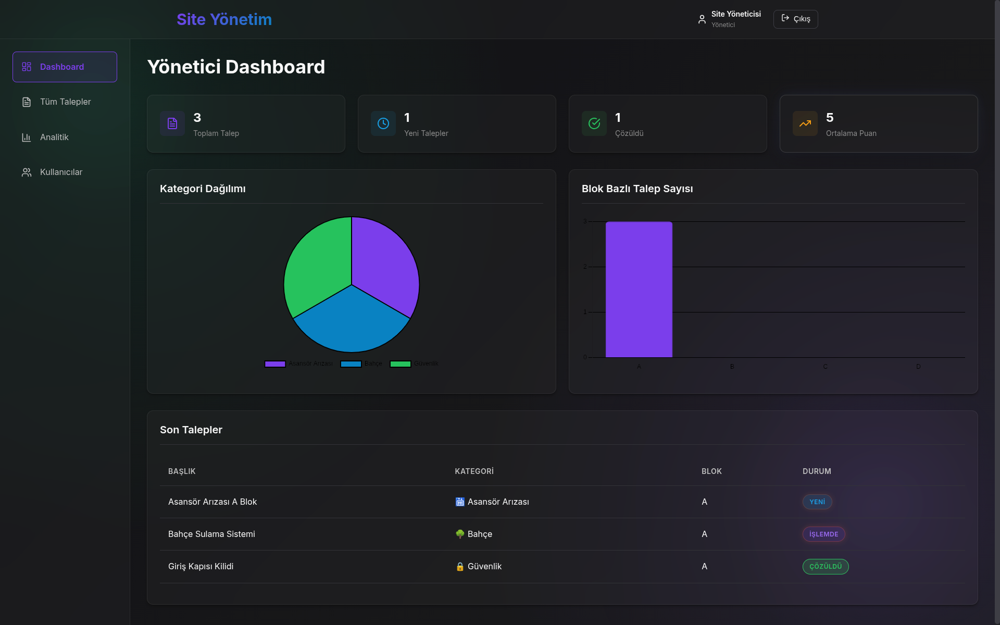

# 🏢 Site İstek & Şikayet Yönetim Sistemi

**Modern, şeffaf ve kullanıcı dostu bir apartman/site yönetim platformu.**

Bu proje, site sakinlerinin taleplerini kolayca iletebileceği, yönetimin iş takibini verimli bir şekilde yapabileceği ve personelin görevlerini mobil uyumlu bir arayüzden yönetebileceği bulut tabanlı bir çözümdür.

---

## 🚀 Proje Hakkında

Geleneksel site yönetim yazılımlarının aksine, bu sistem kurulum maliyeti gerektirmeyen, tamamen tarayıcı tabanlı çalışan modern bir mimariye sahiptir.

### Temel Özellikler
*   **Rol Tabanlı Giriş**: Yönetici, Personel ve Site Sakini için özel arayüzler.
*   **Talep Yönetimi**: Arıza, temizlik veya güvenlik taleplerini anlık oluşturma ve takip etme.
*   **Analitik Dashboard**: Yönetim için grafiksel raporlar ve iş zekası ekranları.
*   **Mobil Uyumlu**: Her cihazda (Telefon, Tablet, PC) kusursuz görünüm.

---

## 🌍 Canlı Demo & Test Hesapları

Projeyi canlı ortamda test etmek için aşağıdaki adresi ve hesap bilgilerini kullanabilirsiniz:

👉 **Uygulama Adresi:** [https://yusakru.github.io/site-yonetim-sistemi/login](https://yusakru.github.io/site-yonetim-sistemi/login)

**Giriş Bilgileri (Tüm hesaplar için şifre: `123456`)**

| Rol | Email | Yetki |
| :--- | :--- | :--- |
| **Yönetici (Admin)** | `admin@site.com` | Tam yetki, sistem yönetimi, raporlar |
| **Personel** | `staff@site.com` | İş taleplerini görüntüleme ve güncelleme |
| **Site Sakini** | `resident@site.com` | Talep oluşturma ve takip etme |

> [!WARNING]
> **ÖNEMLİ GÜVENLİK UYARISI / SECURITY WARNING:**
> Bu proje, Firebase kurulumu yapılmadan kolayca test edilebilmesi için bir **Hibrit Simülasyon (Mock Mode)** barındırır. Varsayılan test e-postaları (`admin@site.com`, `staff@site.com`, `resident@site.com`) ve `123456` şifresi kullanıldığında veritabanı sorguları bypass edilerek yerel profille giriş sağlanır.
>
> **Canlıya (Production) Alırken:** Gerçek sisteminizin güvenliği için [authService.js](src/services/authService.js) içerisindeki `MOCK_USERS` tanımlarını temizlemeli veya devre dışı bırakmalısınız. Aksi takdirde bu e-postalar ile sisteme yönetici olarak yetkisiz giriş yapılabilir!

---

## 🧠 Nasıl Çalışıyor? (Teknik Mimari)

Bu proje, **GitHub Pages** üzerinde barındırılmasına rağmen **tamamen dinamik** bir yapıya sahiptir.
Normalde GitHub Pages sadece statik sayfaları (HTML/CSS) sunar. Ancak biz **JAMstack** mimarisi ile bu sınırı aşıyoruz.

> **Meraklısına:** GitHub Pages üzerinde "Serverless" bir uygulamanın nasıl çalıştığını, "Garson ve Mutfak" analojisi ile anlattığımız detaylı teknik makalemizi okuyun:
>
> 👉 [**Mimari Çalışma Mantığı (JAMstack & Firebase)**](docs/MIMARI_CALISMA_MANTIGI.md)

Kısaca:
1.  **İskelet (Frontend)**: GitHub Pages, React uygulamasını tarayıcınıza gönderir.
2.  **Beyin (Backend)**: Uygulama, kullanıcının tarayıcısında çalışırken arka planda **Google Firebase** ile konuşur.
3.  **Sonuç**: Sunucu maliyeti olmadan, güvenli ve hızlı bir dinamik uygulama.

---

## 🛠️ Kurulum ve Başlangıç

Bu projeyi kendi bilgisayarınızda çalıştırmak veya kendi siteniz için kurmak oldukça basittir.

Detaylı kurulum adımları, Firebase ayarları ve ilk kullanıcının oluşturulması için lütfen rehberimize göz atın:

👉 [**ADIM ADIM KURULUM REHBERİ**](KURULUM_REHBERI.md)

---

## 💻 Teknoloji Yığını

*   **Frontend**: React.js, Vite
*   **Dil**: Modern JavaScript (ES6+)
*   **Stil**: Özel CSS Tasarım Sistemi (Glassmorphism UI)
*   **Backend / Veritabanı**: Google Firebase (Auth, Firestore, Storage)
*   **Görselleştirme**: Chart.js
*   **İkonlar**: Lucide React

---

## 👥 Katkıda Bulunma

1.  Bu repoyu fork'layın.
2.  Yeni bir özellik dalı (feature branch) oluşturun.
3.  Değişikliklerinizi commit'leyin.
4.  Dalınızı push'layın ve bir **Pull Request** oluşturun.

---

## 🇺🇸 Project Summary (English)

**Modern, cloud-based apartment/site management platform.**

This project provides a seamless interface for residents to submit requests (maintenance, security, etc.), and for management to track and assign tasks. Built with a serverless **JAMstack** architecture using **React** and **Google Firebase**.

### Key Features:
- **Role-based Access**: Custom dashboards for Admin, Staff, and Residents.
- **Dynamic Request Management**: Real-time ticket tracking and status updates.
- **Glassmorphism UI**: Premium and modern look using pure CSS.
- **Secure**: Sensitive keys managed via environment variables and GitHub Secrets.

---

## 📸 Ekran Görüntüleri / Screenshots

| Login Page | Resident Dashboard | Admin Panel |
| :---: | :---: | :---: |
|  |  |  |

---
*Geliştirici: [YUSAKRU](https://github.com/yusakru)*
